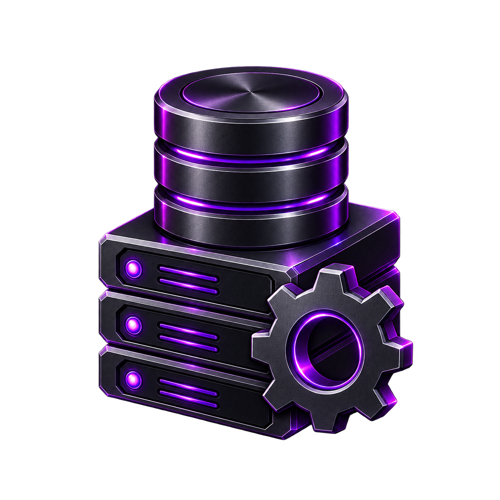

# MrFuji

### Software & Game Developer

`Game Systems` · `Backend` · `Web` · `Developer Tools`

I build game systems, backend tools, web projects, and small utilities while continuing to improve how I structure and maintain my work.

---

## About

Hey, I'm **MrFuji**.

Most of what I know comes from building personal projects, solving problems as they come up, and improving things over time.

I mainly work around **game development, backend systems, web development, servers, and developer tools**.

I enjoy projects where I can work on both the user-facing side and the systems running behind it.

---

## Tech I Work With

  

**Languages**  
Lua · JavaScript · TypeScript · Python · HTML · CSS

**Tools & Platforms**  
Git · GitHub · VS Code · Node.js · MySQL · Linux · Roblox Studio · MTA:SA

---

## Current Focus

Right now I'm spending most of my time on:

- Game systems and server-side logic
- Lua and Luau development
- Backend development
- APIs and databases
- JavaScript and TypeScript
- Linux servers and deployment
- Better project structure and maintainability

I prefer learning technologies when I have a real reason to use them rather than adding tools to a list just for the sake of it.

---

## What I Build

<table>
<tr>

<td width="50%" align="center" valign="top">

### Game Development

Gameplay systems, player data, server-side logic, interfaces, and reusable Lua modules.

</td>

<td width="50%" align="center" valign="top">

### Backend

APIs, database work, validation, server architecture, and small services.

</td>

</tr>

<tr>

<td width="50%" align="center" valign="top">

### Web

Websites, dashboards, interfaces, and practical web tools.

</td>

<td width="50%" align="center" valign="top">

### Infrastructure

Linux servers, hosting, deployment, and cloud environments.

</td>

</tr>
</table>

---

## How I Work

I try to keep projects simple enough to understand and structured enough to grow.

A few things I usually pay attention to:

- Clear project structure
- Readable naming and code
- Reusable systems
- Server-side validation
- Sensible error handling
- Performance
- Documentation
- Maintainability

I'm still learning, and I regularly go back to older work and find things I'd approach differently now.

That's part of the process.

---

## Selected Projects

### Roblox Player Data Service

A lightweight Luau service for managing Roblox player data through a small server-side API.

It includes DataStore persistence, validation, autosaving, safe data access, and documented examples while keeping trusted data changes on the server.

[View Repository](https://github.com/0xfuji/roblox-player-data-service)

> Currently available as an early `v0.1.0` pre-release.

---

## Contact

If you're interested in one of my public projects, the easiest way to reach me is through GitHub.

I'm open to talking about development, collaboration, or anything related to something I've published here.

---

**MrFuji**

`Build · Learn · Create`

